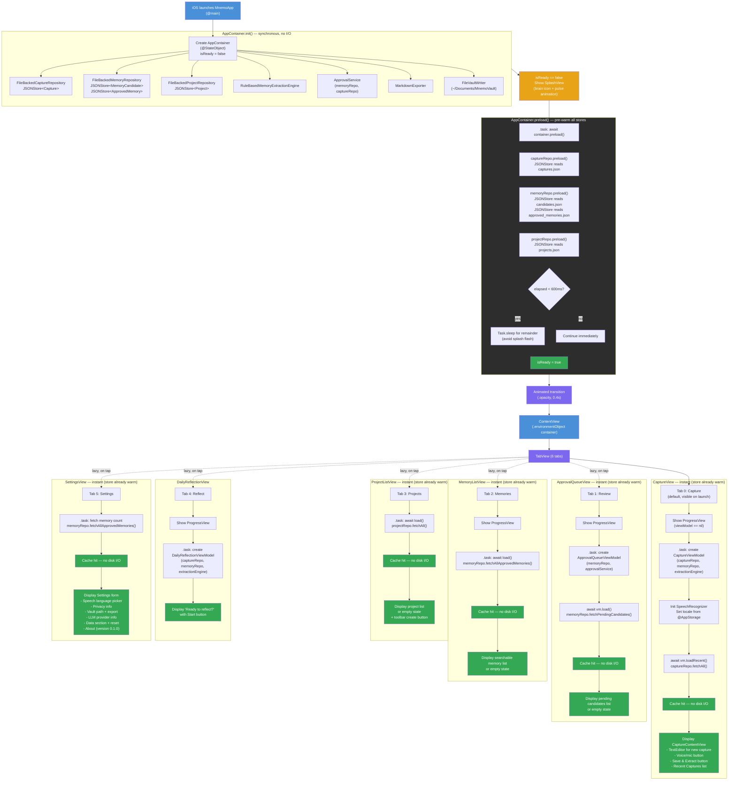

# Mnemo App Startup Flow

## Current Flow (with Splash Screen + Pre-warming)



## How It Works

### Splash Screen + Pre-warming Strategy

The app uses a two-phase startup: a branded splash screen masks a background pre-warming pass that loads all JSON stores into memory before the main UI appears.

| Phase | What happens | Duration |
|-------|-------------|----------|
| 1. Init | `AppContainer` creates repos, services, engine (no I/O) | < 1ms |
| 2. Splash | `SplashView` shown (brain icon with pulse animation) | min 600ms |
| 3. Preload | All 4 JSON stores read from disk into in-memory caches | ~5-50ms typical |
| 4. Transition | Animated opacity crossfade to `ContentView` | 400ms |
| 5. Ready | All tabs served from cache -- zero disk I/O on tab switch | instant |

### Key Files Changed

| File | Change |
|------|--------|
| `JSONStore.swift` | Added `preload()` -- public entry to `ensureLoaded()` |
| `FileBackedRepositories.swift` | Added `preload()` to each repository |
| `AppContainer.swift` | Added `@Published isReady`, private concrete repo refs, `preload()` with 600ms minimum |
| `MnemoApp.swift` | Conditional rendering: `SplashView` while `!isReady`, `ContentView` after, with opacity transition |

### Why This Approach

1. **Perceived speed** -- The splash with a pulsing icon signals intentional loading, not lag. A 600ms minimum prevents a jarring flash for fast loads.
2. **Actual speed** -- Every tab switch after splash is a cache hit. Previously, the first visit to each tab triggered a disk read + JSON decode. Now that cost is paid once, upfront, behind the splash.
3. **No protocol changes** -- `preload()` lives on the concrete `FileBacked*` types. The `CaptureRepository` / `MemoryRepository` / `ProjectRepository` protocols are untouched. `InMemory` repos (used in tests) don't need preloading.

### Before vs After

```
BEFORE: Launch -> ContentView -> Capture tab -> disk I/O -> ready
        (other tabs: each first tap triggers its own disk I/O)

AFTER:  Launch -> Splash (600ms) -> all stores warm -> ContentView -> ready
        (all tabs: instant, cache hits only)
```
