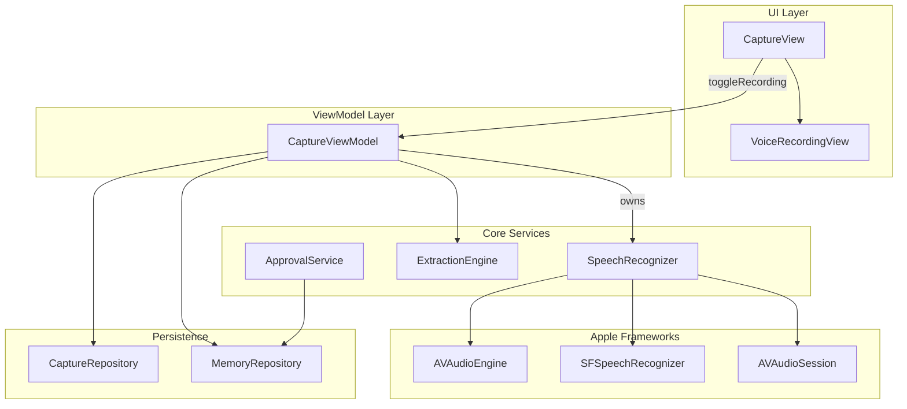
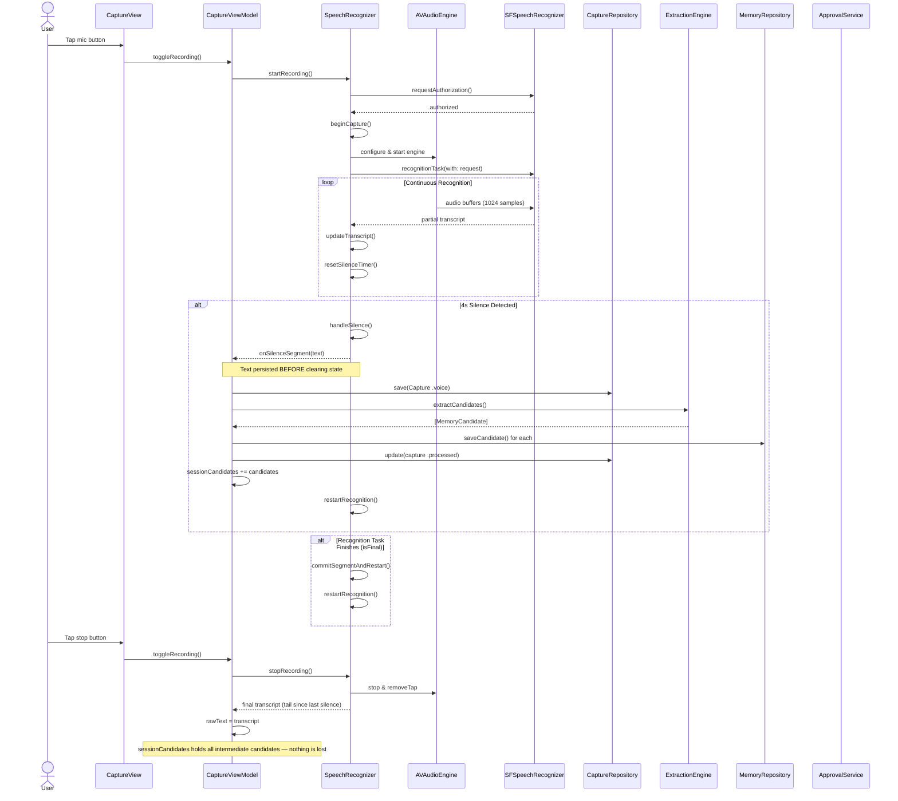
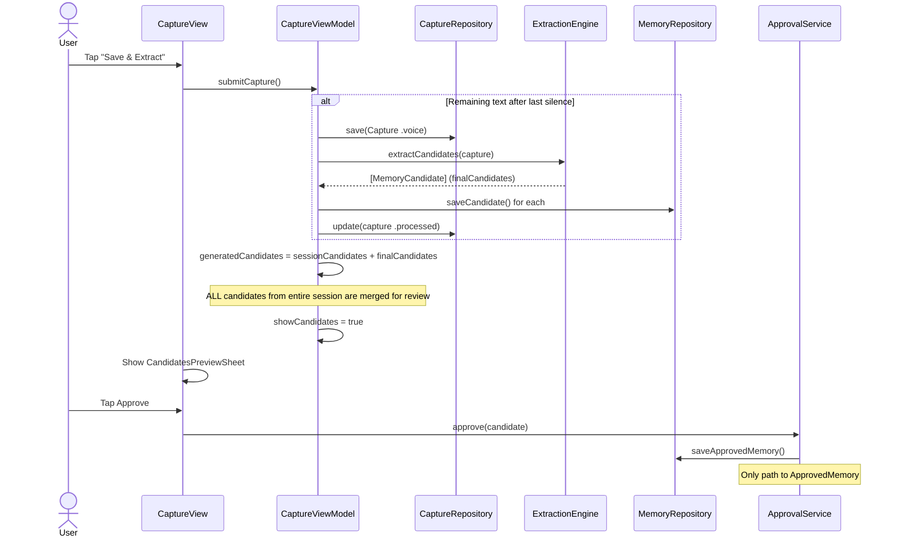
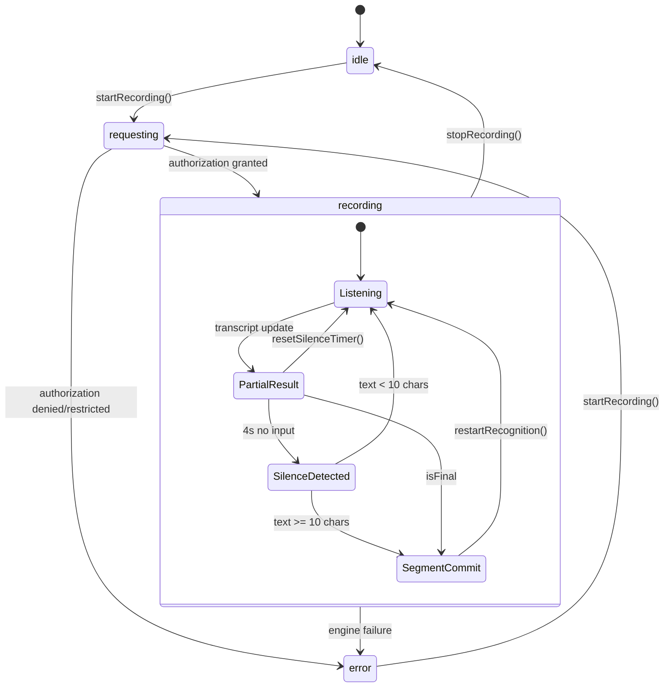

# Voice Recording Architecture

> **ZERO MEMORY LOSS is a non-negotiable invariant.**
> Every word the user speaks must be persisted and reviewable. If any part of the
> transcript is silently discarded — during silence segmentation, on stop, or at
> submit — the app has failed its core purpose. Voice capture exists so users can
> speak freely without worrying about losing thoughts. Any code path that drops
> text is a **blocking defect**.

## Component Overview

## Voice Recording Flow

## Submit After Recording

## SpeechRecognizer State Machine

## Invariants

| Rule | Description |
|---|---|
| **Zero memory loss** | Every word spoken must be persisted and reviewable. Dropping transcript text at any stage is a blocking defect. The app's entire value is that users can trust it to hold their thoughts. |
| **Approval gateway** | `ApprovalService.approve()` is the only path to `ApprovedMemory`. No bypass, no auto-approval. |
| **Full review coverage** | ALL candidates from a recording session (intermediate + final) must appear in the review sheet. Hidden candidates = lost memories from the user's perspective. |

## Key Design Decisions

| Aspect | Decision |
|---|---|
| **On-device recognition** | Preferred when available via `supportsOnDeviceRecognition` |
| **Silence threshold** | 4 seconds triggers segment auto-save |
| **Min segment length** | 10 characters required before silence callback fires |
| **Locale** | Configurable via Settings, defaults to `en-US` |
| **Intermediate saves** | Each silence segment saves a `Capture` and extracts candidates immediately — this is a durability measure so text is never lost even if the app crashes mid-recording |
| **Review completeness** | The review sheet must aggregate candidates from ALL segments in a session, not just the final submit |
